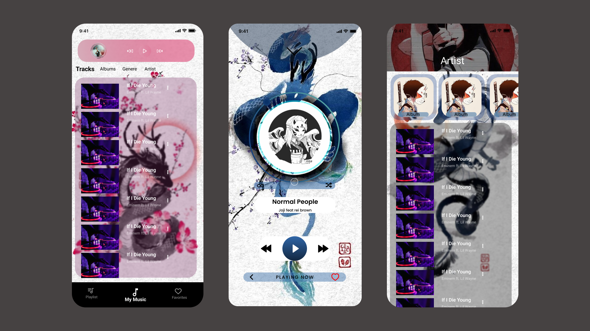

# BenTen

Principalmente BenTen se concibe como una app de musica, que utiliza la musica guardada en el dispositivo, como a la antigua. La principal caracteristica que se quirra destacar del desarrollo, será su apartado visual.
Descarga [Aqui](https://drive.google.com/file/d/1IbNghL2NWxAeItQI_53JMN8KCSJr7JnT/view?usp=drive_link)

## Diseño

Lo que se espera lograr.



Lo que se logro al final.


En cualquiera de los casos el proyecto se puede descargar directamente del repositorio con: 

```
gh repo clone DinoIgnaAndrade/BenTen
```
Y para iniciar el proyecto.
```
npx expo start
```

##### 
[Node Js](https://nodejs.org/en)
En su versión 20.11.1.
Puede Instalar el Node de manera sencilla sin modificar nada en especifico.


[Expo](https://expo.dev/)
En su version ^51.0.8.
Expo tiene tanto las herramientas como las bases para inicializar un nuevo proyecto para android y ios.
```
npx create-expo-app --template
```


[React / React Native](https://expo.dev/)
React version ^18.2.0 
React Native  ^0.74.1
Se instala con Expo.
#####En cualquier caso actualzar a versiones que pida el projecto. 
## Dependencias Utilizadas

#### Reproducción de Video y Musica:

- **@expo-av:^14.0.5**  Proporciona los recursos para la reproduccion de audio.

#### Librerias para el control de archivos:
- **expo-file-system:^17.0.1** 
- **expo-media-library":^16.0.3**
Ambas librerias e utilizan una para encontrar la ruta de los archivos, la otra para que el propio expo-av entienda el Path.

#### Lectura de Metadatos:
- **expo-music-info-2":^2.0.0** Se utiliza para la lectura de la metada de los archivos mp3.

#### Apariencia:
- **react-native-svg:^15.2.0** Por limitaciones tecnicas se tuvo que encontra una alternativa a React Reanimated, con este se realizaron animaciones simples pero con un resultado satisfatorio.

#### Navegacion por ventanas:
- **@react-navigation/bottom-tabs:^6.5.20**
- **@react-navigation/material-top-tabs:^6.6.13**
Ambas son parte de la libreria de React Navigation, utilizadas en la navegacion de la app.

#### Navegación
- **react-redux:^9.1.0**
- **redux:^5.0.1**
Utilizado para la administracion del estado general durante la reproducción.

#### Consideraciones Finales.
El projecto estuvo bastante interesante, no esta terminado eso si porque todavia me faltan herramientas para poder completarlo en su totalidad pero lo abandono ahora hasta tener mas tiempo y ademas no queria dedicarle mas de lo que podia porque tengo otro projectos pendientes. 
Por otro lado, el projecto sirvio para entender mejor algunas librerias y mejorar mi diseño de programacion.
